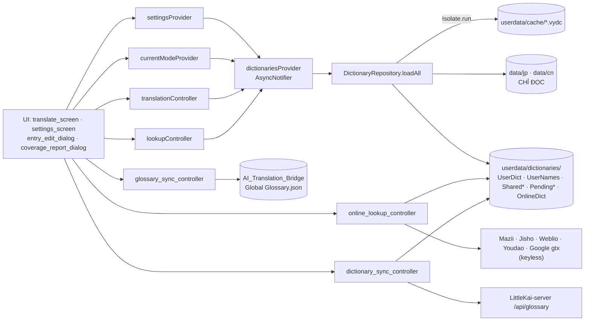

# Project Summary — VietYaku
---
**Last updated:** 2026-09-23 (Release v1.3.3: nhận diện cụm từ đặc biệt, chuẩn hóa giản thể tiếng Nhật, tối ưu lưu/xóa từ điển Names · 563/563 tests passed)

> File này phản ánh **trạng thái hiện tại** của dự án. **Không** dùng làm changelog,
> recent changes, hay bug-fix log — git history là nguồn lịch sử. Lỗi quan trọng,
> khó phát hiện hoặc dễ tái phát thì ghi vào `.claude/IMPORTANT_FIXED_BUGS.md`;
> lỗi vặt thì không ghi đâu cả.

**Cập nhật sau MỌI task đụng tới dự án này:**

- dòng `Last updated` — **luôn**
- `Features Implementation Status` (trong §3): đổi ⏳ → 🚧 → ✅ nếu có thay đổi
- §5 `Known Issues & TODOs`: tick `[x]` mục đã xong, thêm mục mới
- §2 `File Structure` / §6 `Dependencies & External Resources`: **chỉ khi** có
  file, thư mục, hay dependency mới

**Giữ gọn (file này nạp mỗi session):** ô `Details` của dòng ✅ ≤ ~120 ký tự — nói
*cái gì*, không kể từng nút/màu. *Cơ chế + vì sao* ⇒ `DESIGN_DECISIONS.md`; bẫy ⇒
`IMPORTANT_FIXED_BUGS.md`; chi tiết UI ⇒ không ghi (code + git đã có). Vượt ~45KB ⇒
dọn trước khi thêm.

Không tồn tại file này ⇒ coi như task "review toàn bộ dự án". Thấy nó lệch so với
code ⇒ **hỏi user trước khi làm tiếp**.

## 1. Project Overview

- **Type:** App đa nền tảng (Windows desktop + Android) — dịch Nhật/Trung→Việt kiểu VietPhrase + công cụ sửa từ điển JP, thay thế QuickTranslator_Jap (WinForms). Dịch chính offline; có thêm tính năng online tùy chọn: tra nghĩa Mazii / Google Dịch (Việt) / Jisho (Nhật→Anh) hoặc 有道词典 (Trung→Anh) / Weblio 日中 (Nhật→Trung) và tab Google Translate (endpoint gtx + fallback crawl translate.google.com/m).
- **Phạm vi theo nền tảng** (`lib/core/platform_features.dart` — `PlatformFeatures`): Android có Dịch · Tìm kiếm · Giao diện · Cài đặt · tra online · đồng bộ từ điển chung · TTS; **ẩn** Chuyển đổi EPUB (cần hộp thoại lưu file desktop), Đồng bộ Glossary (thư mục AI_Translation_Bridge chỉ có trên máy Windows), Sửa từ điển (repair ghi file cạnh nguồn), Clipboard reader + hotkey (hook Win32).
- **Tech Stack:** Flutter 3.44.2, Dart ^3.12, Material 3 — SDK tại `D:\3.Flutter\flutter\bin\flutter.bat` (có trong PATH).
- **Package Manager:** pub (flutter pub)
- **i18n:** None (UI tiếng Việt cố định)
- **State Management:** Riverpod 2 — manual providers (Notifier/AsyncNotifier), KHÔNG codegen
- **Styling:** Material 3, hệ thiết kế tập trung `lib/core/theme/app_theme.dart` (`AppTheme.light`/`.dark`, seed indigo `0xFF4F46E5`, font chrome Segoe UI, ~15 component theme cho dialog/ô nhập/dropdown/tab/nút/rail/card/tooltip/snackbar/slider/chip/menu). Hướng thị giác: sáng — rực — viền sắc, lớp nổi sáng hơn canvas, màu nền sáng tím nhạt thanh thoát (`0.025` indigo tint), nền tối đen/than trung tính thuần (`#121214`), trạng thái active luôn mang màu nhấn. Chọn được chế độ giao diện: Sáng, Tối, hoặc Tự động theo hệ thống (lưu `ui.themeMode` trong settings). Tự động nâng sáng màu Katakana ở chế độ Tối (Xanh lục tươi `#66BB6A`, Trắng `#FFFFFF`). Màu tô nổi + token Names qua `ThemeExtension AppSemanticColors` (sáng/tối riêng).
- **Deployment:**
  - **Windows:** `flutter build windows --release` → exe độc lập tại `build\windows\x64\runner\Release\vietyaku.exe`. Từ điển đi kèm dạng assets nên exe lớn thêm ~155MB.
  - **Android:** `flutter build apk --release` → APK. Ký bằng debug key mặc định; thả `android/key.properties` (đã gitignore, 4 khoá `storeFile`/`storePassword`/`keyAlias`/`keyPassword`) vào là `build.gradle.kts` tự dùng keystore thật, không phải sửa code. `minSdk` 24 · `targetSdk`/`compileSdk` 36 · AGP 9.0.1 · Gradle 9.1.0 · Kotlin 2.3.20 · JDK 17.
  - Skill `build-and-release` build **cả hai** target (mặc định `-Targets "windows,android"`), APK ra `build/release/VietYaku-android-v<version>.apk` và chỉ lên GitHub Release (kênh cập nhật trong app); B2 vẫn chỉ nhận ZIP Windows cho link tải web.
- **Phát hành (2 kênh song song, do skill `build-and-release` lo):** GitHub Release `LittleKai/VietYaku` phục vụ **cập nhật trong app**; Backblaze B2 (`vietyaku-app/version.json` + `vietyaku-app/releases/*.zip`, bucket `alpha-studio`) phục vụ **link tải trên web** tại `giaiphapsangtao.com/studio/vietyaku`. Cùng một file ZIP, B2 gắn thêm version vào tên object. Chi tiết: `.claude/RELEASE.md`.

Dữ liệu từ điển bundle trong dự án (KHÔNG commit git, đi theo bản phát hành qua `assets:` của pubspec), mỗi ngôn ngữ một bộ tại `data/jp/` và `data/cn/` — đường dẫn hardcode (`defaultDataDir` trong settings_provider), không còn UI chọn file trong Cài đặt:
- `data/jp/` (nguồn Drive QuickTranslator_Jap, đã repair simp→JP + userdata migrate): VietPhrase.txt (190.085 — bản `_JP` repair), LacViet.txt (103.988 — bản `_JP`), Names.txt, JaViDict.txt (172.321), + ThieuChuu/Babylon/cedict_ts.u8/ChinesePhienAm*/Pronouns, SudachiVariants.txt (11.299 — biến thể→value VietPhrase, chỉ cặp cùng hệ chữ), SudachiVariantGroups.txt (110.326 nhóm cách viết kana/kanji cho overlay động), SudachiReadings.txt (43.520 — từ=kana đọc; cả ba sinh bởi tool/build_sudachi_assets.dart), Mazii.txt (từ điển Mazii offline Nhật→Việt, format LacViet — value `\n\t` escaped; đã convert đầy đủ 171.299 entry từ MaziiDict.db sau khi loại bỏ các kana đơn).
- `data/cn/` (nguồn `D:\Software\QuickTranslator\Quick Translator Chinese\Data` + userdata migrate): VietPhrase.txt (691.762), LacViet.txt (66.450), Names.txt, ZhViDict.txt (161.194), + bộ chung như trên.
- JaViDict/ZhViDict generate từ SQLite của VocabFlip bằng `tool/export_vocabflip_dicts.py` (chạy 1 lần, conda py312), value escape `\n\t` như LacViet.
- Nguồn gốc (KHÔNG ghi đè): Drive `JP CN Tool\QuickTranslator_Jap` và `D:\Software\QuickTranslator\`.
- Value VietPhrase bundle JP/CN đã được chuẩn hóa thống nhất theo **tầng nghĩa**: dấu `/` thường chỉ ngăn các cách dịch trong cùng tầng (`xào xạc/sà sà/sàn sạt` vẫn là tầng 1); chỉ marker số/từ loại mở tầng mới. Canonical: `(n)/cách 1/cách 2/(2)/(v)/cách 3`. Sau khi phục hồi value gốc rồi migration đúng, 1.145 mục JP + 191 mục CN được sửa; `tool/normalize_vietphrase_values.dart` dry-run hiện `0/190.085` và `0/691.761`. File nguồn ngoài dự án không bị ghi đè.

---

## 1b. Giả định đang giữ

Mọi con số / quyết định **suy ra chứ không được cho sẵn** nằm ở đây kèm nguồn.
Nguồn đổi ⇒ kiểm lại dòng tương ứng trước khi tin vào nó.

| Giả định | Giá trị | Suy ra từ đâu |
|---|---|---|
| `mazii.net/api/search` bỏ qua tham số `dict` | gửi `cnvi` vẫn trả mục từ điển Nhật (`phonetic` kana, `pinyin` rỗng) | Gọi API trực tiếp, không suy từ tài liệu — vì thế mode Trung coi Mazii là miss |
| OpenCC `JPShinjitaiCharacters.txt` là `shinjitai<TAB>kyūjitai` | NGƯỢC chiều tên file gợi ý | Kiểm entry cụ thể 歴/歷, 暦/曆 khi dựng `simp2jp.tsv` |
| Cặp phồn→giản dùng được là 1 UTF-16 code unit → 1 code unit | 2.455 ký tự (từ 85.953 mục cedict) | `tool/build_trad2simp.dart`; cặp lệch độ dài làm `sourceStart` của token trượt khỏi văn bản gốc |
| Nhóm Sudachi gộp theo **dạng chuẩn + cách đọc**, không phải "cách viết thay thế" | trường 11 (読み) là katakana | Đọc SudachiDict raw — nền của luật alias một chiều |
| Từ điển bundle làm artifact lớn thêm | ~155MB cho cả exe lẫn APK | `pubspec.yaml` không cho khai báo `assets:` theo nền tảng |
| `flutter_lints` ^6.0.0 **không** bật `prefer_single_quotes` | phải khai báo tay | `analysis_options.yaml` mặc định để dòng đó ở dạng comment |

## 2. File Structure

### Key Directories
```
VietYaku/
├── CLAUDE.md, .claude/             # docs hệ thống (summary, conventions, fixed bugs, setup report)
├── .github/workflows/guard.yml     # CI: chạy .claude/guard_check.py trên mỗi push/PR (chỉ stdlib)
├── codegraph.json                  # cấu hình loại trừ file/folder khỏi CodeGraph indexer
├── docs/                            # nghiên cứu/roadmap; NGHIEN_CUU_DINH_HUONG_PHAT_TRIEN.md, NGHIEN_CUU_SUDACHI.md, NGHIEN_CUU_TINH_NANG_2026-08.md (chấm điểm tính năng đề xuất)
├── data/jp/, data/cn/              # bộ từ điển theo ngôn ngữ (~123MB; KHÔNG commit git — `.gitignore` có `data/*`, chỉ chừa `data/cn/LuatNhan.txt`; đi theo bản phát hành qua `assets:`). `generated/` là thư mục con app tự ghi khi admin tra AI/online
├── assets/mappings/                # simp2jp.tsv (3.932 + 69 ambiguous), jp_valid_kanji.txt (3.030), simp2jp_overrides.tsv (soạn tay), trad2simp.tsv (2.455 ký tự phồn→giản)
├── tool/                           # build_simp2jp.dart (sinh assets, cần mạng), build_trad2simp.dart (sinh trad2simp.tsv từ data/cn/cedict_ts.u8, không cần mạng), export_jp.dart (CLI repair + verify), normalize_vietphrase_values.dart (dry-run/ghi chuẩn hóa value VietPhrase JP+CN, giữ BOM/CRLF), migrate_userdata_to_vietphrase.py (migrate từ mới trong userdata vào VietPhrase/LacViet gốc), export_vocabflip_dicts.py (sinh JaViDict/ZhViDict.txt từ DB VocabFlip), build_sudachi_assets.dart (sinh SudachiVariants+SudachiVariantGroups+SudachiReadings từ SudachiDict raw, cần mạng), clean_single_kana.dart (lọc bỏ key là 1 ký tự Hiragana/Katakana trong JaViDict.txt), backfill_lookup_overlay.dart (bù overlay VietPhrase cho OnlineDict/AiDict đã lưu trước khi có cơ chế tự thêm)
├── lib/
│   ├── main.dart                   # window_manager (1200×760, min 1000×640), SharedPreferences override, ProviderScope
│   ├── app.dart                    # MaterialApp M3 + HomeShell responsive: ≥720dp → NavigationRail, <720dp → NavigationBar dưới đáy + PopScope (Back về tab Dịch). `homeDestinations()` lọc theo nền tảng (Android bỏ EPUB)
│   ├── core/                       # cjk.dart, app_paths.dart (+ seed bộ ngôn ngữ từ assets trên mobile), concurrency.dart (runWithConcurrency), platform_features.dart (breakpoint 720dp + cờ tính năng theo nền tảng), fnv_hash.dart, tts_service.dart, window_maximize.dart (ép maximize thật lúc khởi động), google_translate.dart (gtx + fallback crawl /m), theme/app_theme.dart (design system + AppSemanticColors)
│   ├── features/
│   │   ├── ai_translation/         # domain (ai_service_type, ai_api_key, ai_key_rotator, ai_service_config, ai_lookup_result) · data (ai_api_client, ai_settings_repository) · application (ai_settings_controller, ai_lookup_controller) · presentation (ai_settings_dialog, ai_lookup_dialog)
│   │   ├── analysis/               # domain (coverage_report — độ phủ + cụm chưa dịch + ứng viên tên riêng + cắt cụm lệch + cảnh báo ngoặc/số) · application (coverage_report_provider) · presentation (coverage_report_dialog)
│   │   ├── clipboard/              # domain lọc CJK/debounce/hash/own-write · application bridge WM_CLIPBOARDUPDATE + Ctrl+Shift+V (Windows)
│   │   ├── dictionary/             # domain (dict_type, phrase_dictionary, japanese_variant_index, entry_impact) · data (dict_parser, binary_cache, dictionary_loader, japanese_variant_loader, dictionary_repository, user_dict_service) · application (dictionaries_provider, language_pack_provider) · presentation (language_pack_gate — màn tiến độ chép từ điển lần đầu trên mobile)
│   │   ├── dictionary_search/      # domain exact/prefix/wildcard/full-text + overlay winner · worker isolate sống lâu · Search Center UI
│   │   ├── dictionary_sync/        # domain shared entry + sync_reminder (chu kỳ nhắc) · typed HTTP API · merge overlay · Riverpod admin session/sync controller · presentation (sync_reminder_dialog)
│   │   ├── epub_converter/         # đọc EPUB spine/OPF + xuất CSV/XLSX/MD/DOCX/TXT; UI chọn file/xem trước/lưu
│   │   ├── glossary/               # domain (glossary_term, glossary_term_change) · data (glossary_service — đọc/ghi `Global Glossary.json` JP/CN của AI_Translation_Bridge; glossary_term_queue — hàng đợi `PendingGlossary_<mode>.txt` chờ đẩy lên server) · application (glossary_service_provider — service dùng cho MỌI chỗ ghi, tự xếp hàng khi là admin; glossary_sync_controller — ghép 2 bên, lọc trùng/created_by) · presentation (glossary_update_dialog — `showGlossaryUpdateDialog` xác nhận ghi theo nghĩa VietPhrase + `showGlossaryEditDialog` sửa riêng `target`; glossary_sync_screen — đồng bộ hàng loạt 2 chiều, có phân trang)
│   │   ├── translation/            # domain (translation_engine, translation_rule, token, vietphrase_value, reading_extractor, online_lookup_source, trad2simp_table, dict_entry_filter, meaning_panel_layout) · data (translation_rule_repository + các API online) · application (translation_controller + currentModeProvider, translation_rules_provider, lookup/online lookup, trad2simp, token_selection, viet_draft) · presentation (translate_screen, source/result/viet/han_viet pane, token_text_view, translation_rule_tester_dialog, lacviet_panel)
│   │   ├── repair/                 # domain (jp_repair_pipeline, simp2jp_table, repair_report) · application (repair_controller) · presentation (repair_screen, repair_preview)
│   │   └── settings/               # settings_provider, settings_screen (3 tab: Chung — thuật toán/popup/tra online/dịch AI/tốc độ đọc/sync + thư mục Glossary + màn đồng bộ Glossary ↔ VietPhrase (chỉ admin)/update; Tiếng Nhật — kana+Sudachi+giọng Nhật+repair; Tiếng Trung — phồn→giản+giọng Trung), appearance_screen (cỡ chữ+font/màu kana/hiển thị)
│   └── shared/widgets/             # tts_button, entry_edit_dialog, app_dialog, feature_help_button (`?` + dialog giải thích), icon_context_menu, settings_layout, markdown_body_view (render nghĩa AI)
└── test/                           # 561 tests (60 file; integration dữ liệu thật tự skip nếu thiếu path)
```

### Critical Files
| File | Purpose | Notes |
|------|---------|-------|
| `lib/features/translation/domain/translation_engine.dart` | Engine greedy longest-match | Chữ ký `translate()` chừa sẵn cho AiTranslationEngine v2 |
| `lib/features/translation/domain/vietphrase_value.dart` | Parse/encode tầng nghĩa + từ loại VietPhrase | Một tầng chứa nhiều cách dịch ngăn bởi `/`; đọc tương thích marker cũ `/(2)/`, `/(2)`, `/(n)/`, `/(v)`; ngoặc nội dung không phải marker vẫn giữ nguyên |
| `tool/normalize_vietphrase_values.dart` | Migration value VietPhrase về một chuẩn | Mặc định dry-run; `--write` ghi JP+CN, verify idempotent + giữ BOM/CRLF/final newline |
| `lib/features/translation/domain/jp_input_normalizer.dart` | Halfwidth katakana → fullwidth trước khi tra (mode Nhật) | BẮT BUỘC remap token về offset gốc bằng `toOriginal` |
| `lib/features/translation/domain/kanji_numeral.dart` | Gộp run số kanji không match → số Ả Rập | Chỉ run ≥2 token hanViet/unmatched liền kề; parse fail giữ nguyên |
| `lib/features/translation/domain/secondary_phrase.dart` + `application/secondary_phrases_provider.dart` | Cụm kana chỉ có trong Lạc Việt/Nhật Việt/Mazii, KHÔNG có trong VietPhrase | Greedy longest-match trên run token unmatched, ≥2 rune; provider chỉ mode Nhật; `secondaryPhraseStartingAt` tra lại cụm bắt đầu đúng offset khi click giữa cụm. Hai provider: `secondaryPhrasesProvider` (đủ từ điển — dùng cho click chọn) và `vietPhrasePaneSecondaryPhrasesProvider` (**chỉ Lạc Việt** — dùng để đánh dấu trong ô VietPhrase); `jaVi`/`mazii`/`onlineDict`/`aiDict` đều là tham số nullable |
| `lib/features/dictionary/data/binary_cache.dart` | Format cache `.vydc` | Header: magic/version/FNV-1a/size/mtime/count |
| `lib/features/dictionary/data/dictionary_loader.dart` | Load qua `Isolate.run` | Invalidation: so size trước, lệch mtime mới hash |
| `lib/features/repair/domain/jp_repair_pipeline.dart` | Sửa key: space + simp→JP, dedupe | VALUE KHÔNG ĐỔI 1 BYTE |
| `lib/features/dictionary/data/dictionary_repository.dart` | Load 12 dict + overlay, theo mode | `*_JP.txt` trong appdata chỉ ưu tiên ở mode Nhật (bộ CN dùng thẳng file cấu hình) |
| `tool/build_simp2jp.dart` | Sinh assets mapping | OpenCC JPShinjitaiCharacters map NGƯỢC chiều — đã đảo (xem IMPORTANT_FIXED_BUGS.md) |
| `tool/build_trad2simp.dart` | Sinh `assets/mappings/trad2simp.tsv` | Đọc `data/cn/cedict_ts.u8`, ghép cột phồn/giản theo từng code unit trên 85.953 mục; ký tự có nhiều giản thể (23 cái) lấy bản hay gặp nhất |

---

## 3. Architecture & Patterns

### Component Structure
Feature-first: mỗi feature chia `domain/` (thuần Dart, không Flutter) · `data/` (IO, parse, cache) · `application/` (Riverpod providers/controllers) · `presentation/` (widgets). Widget dùng `ConsumerWidget`/`ConsumerStatefulWidget`.

### State Management
- Riverpod manual: `NotifierProvider` (settings, translation, lookup, repair, recent files), `AsyncNotifierProvider` (dictionaries, saved words), `FutureProvider` (appPaths, ttsService, simp2jpTable).
- `sharedPreferencesProvider` override trong `main()` sau `SharedPreferences.getInstance()`.
- Cơ chế đồng bộ từ điển chung · Global Glossary · tra AI (key, định dạng JSON, 3 từ điển sinh ra, vì sao phải vào overlay VietPhrase) · bố cục ô Nghĩa · `refreshCurrent` · xóa từ · rào chắn promote · chỗ ghi theo vai trò · nhắc cập nhật · engine options ⇒ **`.claude/DESIGN_DECISIONS.md` §"Cơ chế tra · ghi · đồng bộ từ điển"**.
- Engine: `HashMap<String,String>` + `maxLenByFirstUnit: Map<int,int>` per dict (key = UTF-16 code unit đầu). Tie-break UserDict > Names > VietPhrase. Fallback chữ Hán đơn → ChinesePhienAmWords; kana/lạ → passthrough.
- Token giữ `rawValue` (value dict nguyên bản); `meaning`/`display`/`displayAll` là getter — đổi tab một nghĩa/đa nghĩa chỉ đổi render, không re-translate.

### Data Flow
settings (paths) → dictionaries_provider → DictionaryRepository.loadAll (12 dict chính + UserNames local + 2 shared overlay, tải song song qua `Isolate.run`; cache `.vydc` hợp lệ → decode, không thì parse text + ghi cache) → mode Nhật + Sudachi bật: `SudachiVariantGroups` (nạp song song với các dict) mở rộng UserDict/UserNames/shared VietPhrase/shared Lạc Việt bằng alias kana/kanji an toàn (luật alias: DESIGN_DECISIONS) → shared VietPhrase/Lạc Việt đè entry cùng key trong file bundle → LoadedDictionaries.engineWith(algorithm, prioritizeNames) → translation_controller.translate → tokens + hanVietTokens → TokenTextView: nháy chuột → lookup; chuột phải không tô đen → paste nghĩa vào ô Bản dịch nhưng không đổi active/highlight; chuột phải khi tô đen → admin sửa VietPhrase/Lạc Việt cục bộ và xếp hàng Update, non-admin sửa UserDict, Names luôn local.

### State & Data Dependency Graph



**Invalidate / refresh rules** — hợp đồng bắt buộc, sai là UI hiện nghĩa cũ:

| Sau khi ghi dữ liệu ở | Phải gọi | Nếu quên sẽ bị |
|---|---|---|
| `UserDictService.upsertUserDict/upsertUserName` (`entry_edit_dialog.dart:77`) | `dictionariesProvider.notifier.reload()` **rồi** `translationController.translate(sourceText)` | Entry vừa thêm không áp dụng cho đến khi bấm Dịch Lại |
| Thêm entry hàng loạt từ Kiểm tra (`coverage_report_dialog.dart:188`) | `reload()` + `translate(sourceText)` | Tên riêng vừa lưu vẫn hiện chưa dịch |
| Pull delta / publish shared dict (`dictionary_sync_controller.dart:299`) | `reload()` + `translate(sourceText)` | Bản dịch không đổi dù từ điển chung đã cập nhật |
| Lưu nghĩa online vào `OnlineDict_<mode>.txt` (`online_lookup_controller.dart:137`) | `dictionaries.reload()` | Lần tra sau vẫn gọi mạng thay vì đọc offline |
| Lưu phân tích AI vào `AiDict_<mode>.txt` (`ai_lookup_controller.dart:156`) | `dictionaries.reload()` + `lookup.refreshCurrent()` | Ô Nghĩa không cập nhật mục AI vừa tra |
| Repair xuất `*_JP.txt` (`repair_controller.dart:179`) | `reloadAll()` — **không** `reload()`, vì `reload()` giữ dict nguồn cũ trong RAM | Màn Dịch vẫn dùng bộ dict trước khi repair |
| Ghi Glossary hai chiều (`glossary_sync_controller.dart:177,180`) | `invalidate(glossarySyncRowsProvider(...))` **cả 2 chiều** | Bảng đồng bộ vẫn liệt kê mục vừa xử lý |
| Ghi Glossary từ dialog sửa entry (`glossary_update_dialog.dart`) | `invalidate(glossarySyncRowsProvider(...))` **cả 2 chiều** + trả `true` để dialog gọi đọc lại glossary | Bảng đồng bộ và thẻ trạng thái Glossary trong dialog vẫn hiện dữ liệu trước khi ghi |

**Rebuild tự động** (không cần gọi tay) — `dictionariesProvider` watch: `appPathsProvider` · `currentModeProvider` · `settings.dictPathsFor(mode)` · `settings.sudachiVariants` · `settings.convertTraditionalToSimplified`. Đổi thuật toán dịch / `prioritizeNames` **không** reload dict (áp ở `engineWith`, có hiệu lực lần Dịch kế tiếp).

**`reload()` vs `reloadAll()`** — `reload()` chỉ đọc lại file overlay (UserDict, UserNames, Shared*, OnlineDict/AiDict/AiEntries, VietPhrase overlay) và dùng lại `DictionaryBase` (dict nguồn lớn + `SudachiVariantGroups` + LuatNhan) mà `loadAll` trả kèm; chỉ dùng lại khi khóa cấu hình (thư mục, mode, dictPaths, sudachiVariants, trad2simp) không đổi. Ghi vào dict NGUỒN ⇒ phải `reloadAll()`. Rebuild do watch/`ref.invalidate` luôn nạp toàn bộ.

> ⚠️ **KHÔNG** watch `translationControllerProvider` từ `dictionariesProvider` — vòng phụ thuộc Riverpod, xem `.claude/IMPORTANT_FIXED_BUGS.md`. Mode phải tách riêng qua `currentModeProvider`.
>
> Cache `.vydc` có invalidation riêng, độc lập với Riverpod: size lệch ⇒ bỏ; size khớp + mtime khớp **và** nguồn cũ hơn file cache ≥2s (`BinaryCache.trustsMtime`) ⇒ dùng; còn lại hash FNV-1a. Đổi format cache phải tăng `BinaryCache.version`. Bộ CN đã quy giản mang `Trad2SimpTable.signature` trong tên file cache.

### Layout màn hình Dịch (kiểu QuickTranslator, tham khảo .claude/image.png)
Menu bar trên cùng (chọn Nhật/Trung + Dán & Dịch). Trái (flex 2): tabs [Nguồn | Hán Việt] qua TabBar + IndexedStack (giữ state SourcePane) trên, LacVietPanel ("Nghĩa", có nút tra online) dưới. Phải (flex 3): ResultPane với tabs [VietPhrase một nghĩa | VietPhrase (đa nghĩa) — mặc định | Google Dịch (tab tạo khi bấm nút, dịch online cả đoạn)] — 1 TokenTextView duy nhất, đổi tab chỉ đổi `textOf` (display/displayAll). Nút chỉnh cỡ chữ + font các ô nằm ở NavigationRail trái.

### Features Implementation Status

| Feature | Status | Key Files | Details |
|---------|--------|-----------|---------|
| Đổi theme Sáng / Tối / Tự động | ✅ Done | app_theme.dart, settings_provider.dart, appearance_screen.dart | Lưu `ui.themeMode`, Dark mode tự tăng tương phản Katakana |
| Chọn giọng đọc + tốc độ TTS | ✅ Done | tts_service, settings_provider, settings_screen, tts_button | Tách riêng Nhật/Trung, độc lập 0.1–1.0, "Nghe thử" |
| Nền tảng Android | ✅ Done | android/*, main.dart, app_paths.dart, platform_features.dart, concurrency.dart, language_pack_provider/gate, app.dart, translate_screen, dictionary_search_screen | Manifest `INTERNET` + `largeHeap`; seed đúng bộ ngôn ngữ đang dùng; tối đa 2 isolate; NavigationBar 5 tab |
| JP repair pipeline + RepairScreen | ✅ Done | jp_repair_pipeline, simp2jp_table, repair_controller, repair_screen | VietPhrase: 13.317 space, 82.454 chữ converted (机→機, 准→準, 言叶→言葉...) |
| UserDict/UserNames overlay | ✅ Done | user_dict_service, entry_edit_dialog, dictionary_repository | Sửa nghĩa áp dụng ngay, không đụng file gốc; xóa Names gốc ghi tombstone deleteSentinel |
| Alias kana/kanji động cho overlay Nhật | ✅ Done | japanese_variant_index, japanese_variant_loader, dictionary_repository, build_sudachi_assets | Overlay tự nhận cách viết cùng nhóm Sudachi; luật một chiều, không bắc cầu Hán ⇄ katakana — DESIGN_DECISIONS |
| Đồng bộ VietPhrase/Lạc Việt chung | ✅ Done | dictionary_sync/*, dictionary_repository, entry_edit_dialog | Pull delta, admin sửa pending + atomic publish; xóa bằng tombstone `deleteSentinel` che cả từ gốc; `loadAll` replay pending |
| Nhắc cập nhật từ điển chung định kỳ | ✅ Done | sync_reminder, dictionary_sync_controller, sync_reminder_dialog, app.dart, settings_screen | Mở app quá chu kỳ (mặc định 30 ngày, tối thiểu 14, chọn được Tắt) → hỏi có cập nhật không |
| Tra cứu & phân tích AI | ✅ Done | ai_translation/*, settings_screen, lacviet_panel, source_pane, token_text_view | 5 nhà cung cấp (Gemini CLI/API, ChatGPT, Claude, Grok); nhập key tay, xoay vòng key theo weight; kết quả JSON render bằng Markdown |
| Từ AI tự vào từ điển dịch | ✅ Done | ai_lookup_result, ai_lookup_controller, user_dict_service, dictionary_repository | `sub_entries` (đã đưa về thân từ: `チャラい` → `チャラ`) ghi vào `AiEntries_<mode>.txt`; key VietPhrase chưa có thì thêm vào overlay `VietPhrase_<mode>.txt` |
| Tuỳ chỉnh bố cục ô Nghĩa (bật/tắt + kéo sắp xếp) | ✅ Done | meaning_panel_layout, settings_provider, settings_screen, lacviet_panel | Riêng JP/CN; hàng chip kéo-thả (Draggable/DragTarget) + dialog bật/tắt |
| Tô đen + copy header ô Nghĩa | ✅ Done | lacviet_panel | `SelectionArea` bọc cụm từ · phát âm · Hán Việt → kéo chọn cả khối rồi Ctrl+C hoặc menu chuột phải (thân panel vốn đã là `SelectableText`) |
| Từ điển sinh khi tra vào bộ dùng chung | ✅ Done | settings_provider (`generatedDictDir`), dictionary_repository, ai/online lookup controller | Admin ghi `data/<lang>/generated/`, chưa đăng nhập ghi `userdata/dictionaries/`; app nạp và merge cả hai |
| Bộ dict theo ngôn ngữ (data/jp, data/cn) | ✅ Done | settings_provider, dictionary_repository, dictionaries_provider | Đổi mode → reload bộ dict tương ứng |
| Quy phồn thể → giản thể (mode Trung) | ✅ Done | trad2simp_table, trad2simp_provider, build_trad2simp.dart | 2.455 ký tự phồn→giản từ cedict_ts.u8 |
| Quy key từ điển Trung về giản thể | ✅ Done | dictionary_loader (`normalizeKeysToSimplified`), dictionary_repository | Chạy trong isolate, key giản thể thắng |
| Menu bar Nhật/Trung + Dịch Lại + Dán & Dịch | ✅ Done | translate_screen, translation_controller, source_pane | Màu nhấn riêng biệt từng nút |
| Chỉnh cỡ chữ + font các ô & toàn giao diện | ✅ Done | appearance_screen, settings_provider, app_theme | Scale 80–140%, font áp lên theme chrome |
| Tra nghĩa online (4 nguồn song song) | ✅ Done | online_lookup_source, online_lookup_controller, online_lookup_dialog | Mazii, Google, Jisho / Youdao, Weblio; lưu offline |
| Tab Google Dịch cả đoạn | ✅ Done | result_pane, google_translate | gtx endpoint + fallback crawl |
| Layout tabs kiểu QT + VietPhrase đa nghĩa/từ loại | ✅ Done | vietphrase_value, token, translate_screen, result_pane, token_text_view, appearance_screen, settings_provider, entry_edit_dialog | Đổi tab không re-translate; nhãn từ loại `[DT]`…; 4 kiểu hiển thị đa nghĩa (Cài đặt → Giao diện, mặc định phân cấp màu) |
| Tab Hán Việt toàn văn | ✅ Done | han_viet_pane, translation_controller | Tính cùng lượt dịch |
| Thuật toán dịch + Ưu tiên Name | ✅ Done | translation_engine, settings_provider, settings_screen | Trái→phải, Cụm dài, Cụm dài ≥4; Prioritize Names |
| Quy tắc hậu xử lý regex + Luật Nhân + rule tester | ✅ Done | translation_rule, translation_rule_repository, translation_rule_tester_dialog | Regex atomic mode, Luật Nhân hơn 200 rule QT_Jap |
| Chọn kiểu caret + tô nổi đỏ đồng bộ 3 pane | ✅ Done | token_selection, source_pane, token_text_view | Nháy chuột chọn cụm, highlight 2 chiều; active từ ở ô VietPhrase / Hán Việt thì ô Nguồn tự cuộn tới cụm khi cụm đang ngoài khung nhìn |
| Nhận diện cụm từ điển phụ | ✅ Done | secondary_phrase, secondary_phrases_provider, token_text_view | Mode Nhật: click chọn tra Lạc Việt > Nhật Việt > Mazii > Online > AI; **đánh dấu trong ô VietPhrase chỉ theo Lạc Việt** |
| Ô Nghĩa đa từ điển + popup tra nhanh | ✅ Done | lookup_controller, lacviet_panel, source_pane, vietphrase_value | VietPhrase → Lạc Việt → Mazii → Nhật Việt → …; mục VietPhrase định dạng `/` thành `; ` phân tách nghĩa sạch; popup neo ở ô Nguồn, hiện cho từ được active ở bất kỳ ô nào (Nguồn / VietPhrase / Hán Việt) |
| Từ điển Mazii offline (Nhật→Việt) | ✅ Done | dict_type, dictionary_repository, lookup_controller | 171.299 entry từ MaziiDict.db |
| Sửa từ điển từ toolbar chuột phải | ✅ Done | source_pane, token_text_view, icon_context_menu, entry_edit_dialog, user_dict_service | Đổi ô Từ nguồn nạp lại preview theo key mới; nút Xóa hiện đúng dict mục tiêu; xóa Names hỗ trợ cả base; Glossary không áp dụng cho Names |
| Chuyển đổi EPUB | ✅ Done | epub_converter/*, app.dart | Nhúng ảnh thật vào DOCX, xuất CSV/XLSX/MD/DOCX/TXT |
| Tự động kiểm tra cập nhật (GitHub Releases) | ✅ Done | features/update/*, app.dart, settings_provider | Windows: ZIP + bat script. Android: `findAndroidApkAsset` → `OpenFilex.open` trình cài đặt |
| Phát hành lên B2 cho trang tải web | ✅ Done | .claude/skills/build-and-release/scripts/upload-b2.ps1, release.ps1 | Đẩy ZIP + `version.json` lên `vietyaku-app/` để `/studio/vietyaku` tải về |
| Đẩy từ sang Global Glossary | ✅ Done | features/glossary/*, settings_provider, entry_edit_dialog | Ghi `Global Glossary.json` JP/CN của AI_Translation_Bridge |
| Đẩy Global Glossary lên server cho AI_Translation_Bridge | ✅ Done | glossary_service_provider, glossary_term_queue, dictionary_sync_api/controller | Phiên admin ghi glossary → xếp hàng `PendingGlossary_<mode>.txt` → `POST /api/glossary/terms/sync` khi bấm Update, hoặc tự Update khi tổng mục chờ (từ điển + glossary) đạt 10 |
| Đồng bộ hàng loạt Glossary ↔ VietPhrase | ✅ Done | features/glossary/*, dictionary_sync_controller | 2 chiều, phân trang, lọc trùng/không trùng |
| Kiểm tra: độ phủ + top từ chưa dịch + soát lỗi | ✅ Done | features/analysis/*, translate_screen | Độ phủ CJK, gợi ý tên riêng, cắt cụm lệch, lệch ngoặc |
| Clipboard reader + global hotkey | ✅ Done | features/clipboard/*, settings_provider | `WM_CLIPBOARDUPDATE` + `Ctrl+Shift+V` |
| Preview tác động trước khi sửa/publish | ✅ Done | dictionary/domain/entry_impact, entry_edit_dialog | `base ‖ hiện tại ‖ mới`, số lần xuất hiện |
| Search Center / tra ngược | ✅ Done | features/dictionary_search/*, app.dart | Exact/prefix/wildcard/full-text, overlay winner |
| Quét mã QR ủng hộ nhà phát triển | ✅ Done | features/settings/presentation/donate_dialog.dart, settings_screen.dart | VietQR Vietcombank 0071000718658, sao chép STK, tải ảnh QR về máy (file_selector trên desktop + Downloads trên mobile) |

**Verify end-to-end:** `dart run tool/normalize_vietphrase_values.dart` → JP `0/190.085`, CN `0/691.761` entry cần chuẩn hóa. `dart run tool/export_jp.dart` → VietPhrase_JP.txt + LacViet_JP.txt cạnh file gốc; hết key `覚 悟`/`军`, value nguyên vẹn từng byte; dịch Nhật match dài, dịch Trung có fallback phiên âm. `flutter test` 563 pass + `flutter analyze --no-pub` sạch; `flutter build windows --release --no-pub` thành công.

**Verify Android (emulator `Medium_Phone_API_36.1`, API 36):** `flutter build apk --debug` → cài chạy được; lần đầu seed `data/jp` (14 file, ~96MB) rồi nạp 14 dict trong ~18s, lần sau đọc `.vydc` — không OOM, không ANR; dán & dịch đoạn Nhật ra đúng tầng nghĩa; nhấn giữ token hiện menu "Chèn vào Bản dịch / Thêm vào UserDict / Thêm vào Names / Tra online"; tab Google Dịch trả kết quả online (xác nhận quyền `INTERNET` trong bản không-debug bằng `aapt2 dump permissions`).

---

## 5. Known Issues & TODOs

### 🔴 High Priority
- (không có)

### 🟡 Medium Priority
- [ ] Chuột phải token (chèn nghĩa không active + menu edit theo quyền) chưa có widget test (hit-test TextSpan với kSecondaryButton phức tạp) — verify tay.
- [ ] Từ điển bundle dạng assets (`data/jp`, `data/cn`) áp cho MỌI nền tảng → APK Android + build Windows đều +~155MB (pubspec không cho khai báo assets theo nền tảng). Trên Android đã giảm nửa phần ghi đĩa bằng cách chỉ seed bộ ngôn ngữ đang dùng (`AppPaths.seedLanguagePack`): mode Nhật ~92MB text + cache `.vydc`, mode Trung ~63MB. Muốn giảm tiếp thì phải chuyển sang asset pack / tải từ server.
- [x] Đã tạo thành công GitHub Release `v1.2.0` (upload `VietYaku-windows-x64.zip` + `VietYaku-android-v1.2.0.apk`). Luồng check update API (`GET .../releases/latest`) và B2 (`version.json`) hiện đã trả về phiên bản mới nhất.

### 🟢 Low Priority / Nice to Have (Backlog v2 — KHÔNG làm v1)
- [ ] EPUB nhúng ảnh thật vào Markdown (`` + xuất kèm thư mục media): DOCX đã nhúng thật; Markdown/CSV/XLSX/TXT hiện vẫn `(img)`.
- [ ] Furigana per-token cho kanji ngoài từ điển (cần MeCab, không có port Dart thuần).
- [ ] AiTranslationEngine (chữ ký `translate()` đã chừa sẵn).
- [ ] Fuzzy match / gợi ý sửa key còn sót.
- [x] Quy tắc hậu xử lý regex + Luật Nhân + rule tester đã hoàn tất; Luật Nhân dùng bộ hơn 200 rule sạch từ QuickTranslator_Jap và 4 phạm vi sử dụng.
- [x] `test/widget_test.dart` đã cập nhật NavigationRail có destination `Tìm kiếm`; full suite 292 test pass.
- [ ] Batch dịch cả thư mục + xuất file (QuickConverter) — chưa có nhu cầu, đã loại khỏi scope đợt này.

### Giới hạn đã biết (by design)
- Quy tắc vàng: ký tự đã hợp lệ JP không convert → không sửa được `后→後`, `干→幹` theo ngữ cảnh; ghi vào RepairReport.ambiguous.
- Ambiguous cố ý không resolve: 复(復/複/覆), 舍(舎/捨), 获(獲/穫), 泛(氾/汎) + ~30 chữ hiếm.
- Screenshot GDI `CopyFromScreen` chụp được cửa sổ Flutter bình thường, NHƯNG chỉ khi cửa sổ thật sự đang foreground. Windows khoá `SetForegroundWindow` với tiến trình nền → phải `AttachThreadInput` vào thread của cửa sổ foreground rồi `SwitchToThisWindow`, và kiểm lại `GetForegroundWindow()` ngay trước khi chụp (đừng gõ ALT để "gỡ khoá" — nó mở Task View). Click tự động cũng cần chuỗi move → hover → down → up, nhảy thẳng vào rồi click ngay thì Flutter chưa kịp hit-test.

---

## 6. Dependencies & External Resources

### Key Dependencies
- flutter_riverpod ^2.6.1 — state management (manual providers)
- window_manager ^0.4.3 — kích thước/min size cửa sổ
- file_selector ^1.0.3 — mở/lưu file (chỉ dùng ở màn EPUB; màn Dịch chưa có mở file, chưa có kéo-thả)
- path_provider ^2.1.5 · path ^1.9.0 — appdata paths
- shared_preferences ^2.3.4 — settings + recent files
- flutter_tts ^4.2.0 — WinRT SpeechSynthesizer (ja-JP / zh-CN, offline)
- archive ^4.0.9 · xml ^7.0.1 · html ^0.15.6 — đọc EPUB và tạo/kiểm tra OOXML DOCX/XLSX
- flutter_markdown_plus ^1.0.12 — render nghĩa AI trong ô Nghĩa + dialog tra AI. Dùng bản `_plus` vì `flutter_markdown` gốc đã bị discontinued; API (`MarkdownBody`/`MarkdownStyleSheet`) giống hệt.
- collection ^1.19.0

### External APIs / Services
- LittleKai-server (tùy chọn): đăng nhập admin + publish/pull delta từ điển chung. URL lưu trong Cài đặt; mặc định local `http://localhost:5000`, build production có thể đặt `--dart-define=LITTLEKAI_SERVER_URL=...`.
- Chỉ lúc dev (`dart run tool/build_simp2jp.dart`): OpenCC STCharacters.txt + JPShinjitaiCharacters.txt (GitHub raw), Himeyama/joyo-kanji joyo2021.txt, aknm21/jinmeiyo-kanji — kết quả đã commit vào assets.
- vocabflip (format export): `D:\Dev\NodeJS\alpha-studio\tools\vocabflip` — validate cần `version`, `decks[].name`, `decks[].source_language`; card cần `front`+`back`, reading → `front_phonetic`.

### Secrets & Credentials

| Thứ | Lưu ở | Ghi chú |
|---|---|---|
| Phiên admin LittleKai-server | SharedPreferences: `username` + `JWT` | **Không lưu mật khẩu**; logout/401 xóa phiên |
| URL server | `--dart-define=LITTLEKAI_SERVER_URL=...` | Mặc định `http://localhost:5000`; không hardcode URL production |
| Từ điển/dữ liệu người dùng | `<exe>/userdata/` (release) · `<repo>/data/userdata/` (debug) | `data/` đã gitignore |
| GitHub token phát hành | `.env`: `GITHUB_TOKEN` | Chỉ skill `build-and-release` đọc |
| Credential Backblaze B2 | `.env`: `B2_ACCESS_KEY_ID`, `B2_SECRET_ACCESS_KEY`, `B2_BUCKET_NAME`, `CDN_BASE_URL` | Cùng giá trị với `alpha-studio-backend/.env`; chỉ `upload-b2.ps1` đọc |

- 4 nguồn tra online (Mazii, Jisho, Weblio, Youdao) + Google gtx đều **keyless** — theo thiết kế không dùng API cần key/trả phí.
- `.env` ở root đã nằm trong `.gitignore` (dòng 48).

> Chỉ ghi **tên biến và nơi lưu**. Không bao giờ ghi giá trị thật của JWT/mật khẩu vào file này.

---

## 7. Important Notes for Claude

### When making changes to:
- **Repair pipeline / dict_parser:** VALUE KHÔNG ĐỔI 1 BYTE là bất biến tuyệt đối; mọi thay đổi phải chạy `flutter test test/repair_pipeline_test.dart` + `dart run tool/export_jp.dart` để verify trên dữ liệu thật.
- **Binary cache:** đổi format → tăng `BinaryCache.version` (cache cũ tự invalid).
- **Engine:** giữ chữ ký `translate(String, {TranslationMode mode})` — v2 sẽ cắm AiTranslationEngine cùng interface.
- **Assets mappings:** không sửa `simp2jp.tsv` tay — sửa build script hoặc `simp2jp_overrides.tsv` rồi chạy lại `dart run tool/build_simp2jp.dart`.
- **File gốc QuickTranslator_Jap:** tuyệt đối không ghi đè; chỉ xuất `*_JP.txt`.

### Testing checklist:
- [ ] `flutter analyze` sạch
- [ ] `flutter test` pass (518 tests; integration tự skip nếu thiếu dữ liệu thật)
- [ ] Nếu đụng repair/parser: `dart run tool/export_jp.dart` verify OK
- [ ] Trước khi release: chạy `.claude/SMOKE_TEST_CHECKLIST.md` trên exe đã build (pipeline hiện chỉ ra bản Windows — xem mục Deployment)

### Don't forget to:
- Update this file's timestamp and session number
- Follow CONVENTIONS.md

---

## 9. Quick Commands

```bash
# Development
flutter run -d windows             # chạy debug
flutter analyze                    # lint — phải sạch

# Build
flutter build windows --release    # exe tại build\windows\x64\runner\Release\

# Test
flutter test                       # toàn bộ 518 tests
```

# Tools (dev)
dart run tool/build_simp2jp.dart   # sinh lại assets mapping (cần mạng)
dart run tool/build_trad2simp.dart # sinh lại bảng phồn→giản từ data/cn/cedict_ts.u8
dart run tool/export_jp.dart       # repair + xuất *_JP.txt + verify dữ liệu thật
```

---

**📌 CRITICAL:** Read this entire file before making any changes to the project.
