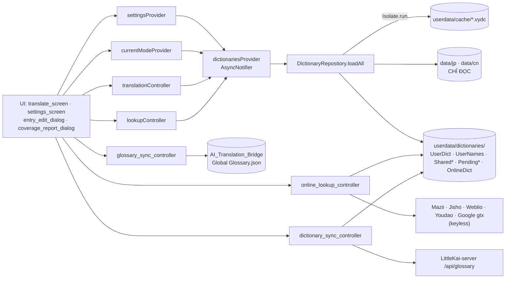

# Project Summary — VietYaku
---

## 1. Project Overview

- **Type:** App đa nền tảng (Windows desktop + Android) — dịch Nhật/Trung→Việt kiểu VietPhrase + công cụ sửa từ điển JP, thay thế QuickTranslator_Jap (WinForms). Dịch chính offline; có thêm tính năng online tùy chọn: tra nghĩa Mazii / Google Dịch (Việt) / Jisho (Nhật→Anh) hoặc 有道词典 (Trung→Anh) / Weblio 日中 (Nhật→Trung) và tab Google Translate (endpoint gtx + fallback crawl translate.google.com/m). Android: chỉ dịch + TTS; ẩn Sửa từ điển/đồng bộ file (desktop-only).
- **Tech Stack:** Flutter 3.44.2, Dart ^3.12, Material 3
- **Package Manager:** pub (flutter pub)
- **i18n:** None (UI tiếng Việt cố định)
- **State Management:** Riverpod 2 — manual providers (Notifier/AsyncNotifier), KHÔNG codegen
- **Styling:** Material 3, hệ thiết kế tập trung `lib/core/theme/app_theme.dart` (`AppTheme.light`/`.dark`, seed indigo `0xFF4F46E5`, font chrome Segoe UI, ~15 component theme cho dialog/ô nhập/dropdown/tab/nút/rail/card/tooltip/snackbar/slider/chip/menu). Hướng thị giác: sáng — rực — viền sắc, lớp nổi sáng hơn canvas, màu nền sáng tím nhạt thanh thoát (`0.025` indigo tint), nền tối đen/than trung tính thuần (`#121214`), trạng thái active luôn mang màu nhấn. Chọn được chế độ giao diện: Sáng, Tối, hoặc Tự động theo hệ thống (lưu `ui.themeMode` trong settings). Tự động nâng sáng màu Katakana ở chế độ Tối (Xanh lục tươi `#66BB6A`, Trắng `#FFFFFF`). Màu tô nổi + token Names qua `ThemeExtension AppSemanticColors` (sáng/tối riêng).
- **Deployment:** Windows: `flutter build windows --release` → exe độc lập tại `build\windows\x64\runner\Release\vietyaku.exe`. Android: `flutter build apk --release` (org `com.littlekai.vietyaku`) — từ điển đi kèm dạng assets nên APK/exe lớn thêm ~130MB.

Dữ liệu từ điển bundle trong dự án (commit git), mỗi ngôn ngữ một bộ tại `data/jp/` và `data/cn/` — đường dẫn hardcode (`defaultDataDir` trong settings_provider), không còn UI chọn file trong Cài đặt:
- `data/jp/` (nguồn Drive QuickTranslator_Jap, đã repair simp→JP): VietPhrase.txt (187.419 — bản `_JP` repair), LacViet.txt (103.632 — bản `_JP`), Names.txt, JaViDict.txt (172.321), + ThieuChuu/Babylon/cedict_ts.u8/ChinesePhienAm*/Pronouns, SudachiVariants.txt (13.677 — biến thể→value VietPhrase, sinh bởi tool/build_sudachi_assets.dart), SudachiReadings.txt (43.996 — từ=kana đọc), Mazii.txt (từ điển Mazii offline Nhật→Việt, format LacViet — value `\n\t` escaped; đã convert đầy đủ 171.299 entry từ MaziiDict.db sau khi loại bỏ các kana đơn).
- `data/cn/` (nguồn `D:\Software\QuickTranslator\Quick Translator Chinese\Data`): VietPhrase.txt (690.007), LacViet.txt (66.450), Names.txt, ZhViDict.txt (161.194), + bộ chung như trên.
- JaViDict/ZhViDict generate từ SQLite của VocabFlip bằng `tool/export_vocabflip_dicts.py` (chạy 1 lần, conda py312), value escape `\n\t` như LacViet.
- Nguồn gốc (KHÔNG ghi đè): Drive `JP CN Tool\QuickTranslator_Jap` và `D:\Software\QuickTranslator\`.

---

## 2. File Structure

### Key Directories
```
VietYaku/
├── CLAUDE.md, .claude/             # docs hệ thống (summary, conventions, fixed bugs, setup report)
├── codegraph.json                  # cấu hình loại trừ file/folder khỏi CodeGraph indexer
├── docs/                            # nghiên cứu/roadmap; NGHIEN_CUU_DINH_HUONG_PHAT_TRIEN.md, NGHIEN_CUU_SUDACHI.md, NGHIEN_CUU_TINH_NANG_2026-08.md (chấm điểm tính năng đề xuất)
├── data/jp/, data/cn/              # bộ từ điển bundle theo ngôn ngữ (commit git, ~123MB)
├── assets/mappings/                # simp2jp.tsv (3.932 + 69 ambiguous), jp_valid_kanji.txt (3.030), simp2jp_overrides.tsv (soạn tay), trad2simp.tsv (2.455 ký tự phồn→giản)
├── tool/                           # build_simp2jp.dart (sinh assets, cần mạng), build_trad2simp.dart (sinh trad2simp.tsv từ data/cn/cedict_ts.u8, không cần mạng), export_jp.dart (CLI repair + verify), export_vocabflip_dicts.py (sinh JaViDict/ZhViDict.txt từ DB VocabFlip), build_sudachi_assets.dart (sinh data/jp/SudachiVariants+SudachiReadings từ SudachiDict raw, cần mạng), clean_single_kana.dart (lọc bỏ key là 1 ký tự Hiragana/Katakana trong JaViDict.txt)
├── lib/
│   ├── main.dart                   # window_manager (1200×760, min 1000×640), SharedPreferences override, ProviderScope
│   ├── app.dart                    # MaterialApp M3 + HomeShell (NavigationRail + IndexedStack 5 tab: Dịch, Tìm kiếm, Giao diện, Cài đặt, EPUB)
│   ├── core/                       # cjk.dart, app_paths.dart, fnv_hash.dart, tts_service.dart, google_translate.dart (gtx + fallback crawl /m), theme/app_theme.dart (design system + AppSemanticColors)
│   ├── features/
│   │   ├── analysis/               # domain (coverage_report — độ phủ + cụm chưa dịch + ứng viên tên riêng + cắt cụm lệch + cảnh báo ngoặc/số) · application (coverage_report_provider) · presentation (coverage_report_dialog)
│   │   ├── clipboard/              # domain lọc CJK/debounce/hash/own-write · application bridge WM_CLIPBOARDUPDATE + Ctrl+Shift+V (Windows)
│   │   ├── dictionary/             # domain (dict_type, phrase_dictionary, entry_impact) · data (dict_parser, binary_cache, dictionary_loader, dictionary_repository, user_dict_service) · application (dictionaries_provider)
│   │   ├── dictionary_search/      # domain exact/prefix/wildcard/full-text + overlay winner · worker isolate sống lâu · Search Center UI
│   │   ├── dictionary_sync/        # domain shared entry · typed HTTP API · merge overlay · Riverpod admin session/sync controller
│   │   ├── epub_converter/         # đọc EPUB spine/OPF + xuất CSV/XLSX/MD/DOCX/TXT; UI chọn file/xem trước/lưu
│   │   ├── glossary/               # domain (glossary_term) · data (glossary_service — đọc/ghi `Global Glossary.json` JP/CN của AI_Translation_Bridge) · application (glossary_sync_controller — ghép 2 bên, lọc trùng/created_by) · presentation (glossary_update_dialog — xác nhận trước khi ghi; glossary_sync_screen — đồng bộ hàng loạt 2 chiều, có phân trang)
│   │   ├── translation/            # domain (translation_engine, translation_rule, token, reading_extractor, online_lookup_source, trad2simp_table) · data (translation_rule_repository + các API online) · application (translation_controller + currentModeProvider, translation_rules_provider, lookup/online lookup, trad2simp, token_selection, viet_draft) · presentation (translate_screen, source/result/viet/han_viet pane, token_text_view, translation_rule_tester_dialog, lacviet_panel)
│   │   ├── repair/                 # domain (jp_repair_pipeline, simp2jp_table, repair_report) · application (repair_controller) · presentation (repair_screen, repair_preview)
│   │   └── settings/               # settings_provider, settings_screen (3 tab: Chung — thuật toán/popup/tra online/tốc độ đọc/sync + thư mục Glossary + màn đồng bộ Glossary ↔ VietPhrase (chỉ admin)/update; Tiếng Nhật — kana+Sudachi+giọng Nhật+repair; Tiếng Trung — phồn→giản+giọng Trung), appearance_screen (cỡ chữ+font/màu kana/hiển thị)
│   └── shared/widgets/             # tts_button, entry_edit_dialog, app_dialog, feature_help_button (`?` + dialog giải thích), icon_context_menu, settings_layout
└── test/                           # 268 tests (36 file; integration dữ liệu thật tự skip nếu thiếu path)
```

### Critical Files
| File | Purpose | Notes |
|------|---------|-------|
| `lib/features/translation/domain/translation_engine.dart` | Engine greedy longest-match | Chữ ký `translate()` chừa sẵn cho AiTranslationEngine v2 |
| `lib/features/translation/domain/jp_input_normalizer.dart` | Halfwidth katakana → fullwidth trước khi tra (mode Nhật) | BẮT BUỘC remap token về offset gốc bằng `toOriginal` |
| `lib/features/translation/domain/kanji_numeral.dart` | Gộp run số kanji không match → số Ả Rập | Chỉ run ≥2 token hanViet/unmatched liền kề; parse fail giữ nguyên |
| `lib/features/translation/domain/secondary_phrase.dart` + `application/secondary_phrases_provider.dart` | Cụm kana chỉ có trong Lạc Việt/Nhật Việt/Mazii, KHÔNG có trong VietPhrase | Greedy longest-match trên run token unmatched, ≥2 rune; provider chỉ mode Nhật; `secondaryPhraseStartingAt` tra lại cụm bắt đầu đúng offset khi click giữa cụm |
| `lib/features/dictionary/data/binary_cache.dart` | Format cache `.vydc` | Header: magic/version/FNV-1a/size/mtime/count |
| `lib/features/dictionary/data/dictionary_loader.dart` | Load qua `Isolate.run` | Invalidation: so size trước, lệch mtime mới hash |
| `lib/features/repair/domain/jp_repair_pipeline.dart` | Sửa key: space + simp→JP, dedupe | VALUE KHÔNG ĐỔI 1 BYTE |
| `lib/features/dictionary/data/dictionary_repository.dart` | Load 12 dict + overlay, theo mode | `*_JP.txt` trong appdata chỉ ưu tiên ở mode Nhật (bộ CN dùng thẳng file cấu hình) |
| `tool/build_simp2jp.dart` | Sinh assets mapping | OpenCC JPShinjitaiCharacters map NGƯỢC chiều — đã đảo (xem IMPORTANT_FIXED_BUGS.md) |
| `tool/build_trad2simp.dart` | Sinh `assets/mappings/trad2simp.tsv` | Đọc `data/cn/cedict_ts.u8`, ghép cột phồn/giản theo từng code unit trên 85.953 mục; ký tự có nhiều giản thể (23 cái) lấy bản hay gặp nhất |

---

## 3. Architecture & Patterns

### Component Structure
Feature-first: mỗi feature chia `domain/` (thuần Dart, không Flutter) · `data/` (IO, parse, cache) · `application/` (Riverpod providers/controllers) · `presentation/` (widgets). Widget dùng `ConsumerWidget`/`ConsumerStatefulWidget`.

### State Management
- Riverpod manual: `NotifierProvider` (settings, translation, lookup, repair, recent files), `AsyncNotifierProvider` (dictionaries, saved words), `FutureProvider` (appPaths, ttsService, simp2jpTable).
- `sharedPreferencesProvider` override trong `main()` sau `SharedPreferences.getInstance()`.
- Đồng bộ từ điển chung chỉ áp dụng cho VietPhrase/Lạc Việt: `GET /api/glossary/sync` kéo các trang delta bằng opaque cursor (public); `POST` publish entry qua JWT admin. `username + JWT` lưu SharedPreferences để khôi phục phiên (không lưu mật khẩu; logout/401 xóa phiên). Admin sửa cục bộ vào `SharedVietPhrase/SharedLacViet_<mode>.txt` và hàng đợi `PendingVietPhrase/PendingLacViet_<mode>.txt`; chỉ bấm `Update` mới upload các mục chờ của cả Nhật/Trung. Cursor lưu riêng theo mode; pull delta xong re-apply pending để không mất sửa đổi chưa upload. Non-admin dùng UserDict; UserNames luôn local.
- Engine: `HashMap<String,String>` + `maxLenByFirstUnit: Map<int,int>` per dict (key = UTF-16 code unit đầu). Tie-break UserDict > Names > VietPhrase. Fallback chữ Hán đơn → ChinesePhienAmWords; kana/lạ → passthrough.
- Engine options (constructor, chữ ký `translate()` không đổi): `TranslationAlgorithm` — `leftToRight` (mặc định) / `longestPhrase` (cụm dài toàn văn đặt trước, khe trống dịch trái→phải chặn biên) / `longestPhrase4` (chỉ cụm ≥4 code unit vào vòng global); `prioritizeNames` — tiered: dict đứng trước có match (bất kỳ độ dài) thắng dict sau (UserDict ngắn vẫn thắng cụm dài — cố ý). Settings áp dụng ở lần Dịch kế tiếp.
- Token giữ `rawValue` (value dict nguyên bản); `meaning`/`display`/`displayAll` là getter — đổi tab một nghĩa/đa nghĩa chỉ đổi render, không re-translate.
- `dictionariesProvider` watch `currentModeProvider` (đổi Nhật/Trung → nạp lại bộ dict của mode, cache .vydc giữ nhanh) + `settingsProvider.select(dictPathsFor(mode))` — đổi thuật toán không reload dict. LƯU Ý: không được watch `translationControllerProvider` từ dictionariesProvider (vòng phụ thuộc Riverpod — xem IMPORTANT_FIXED_BUGS.md); mode tách riêng ở `currentModeProvider`.

### Data Flow
settings (paths) → dictionaries_provider → DictionaryRepository.loadAll (12 dict chính + UserNames local + 2 shared overlay, tải song song qua `Isolate.run`; cache `.vydc` hợp lệ → decode, không thì parse text + ghi cache) → shared VietPhrase/Lạc Việt đè entry cùng key trong file bundle → LoadedDictionaries.engineWith(algorithm, prioritizeNames) → translation_controller.translate → tokens + hanVietTokens → TokenTextView: nháy chuột → lookup; chuột phải không tô đen → paste nghĩa vào ô Bản dịch nhưng không đổi active/highlight; chuột phải khi tô đen → admin sửa VietPhrase/Lạc Việt cục bộ và xếp hàng Update, non-admin sửa UserDict, Names luôn local.

### State & Data Dependency Graph



**Invalidate / refresh rules** — hợp đồng bắt buộc, sai là UI hiện nghĩa cũ:

| Sau khi ghi dữ liệu ở | Phải gọi | Nếu quên sẽ bị |
|---|---|---|
| `UserDictService.upsertUserDict/upsertUserName` (`entry_edit_dialog.dart:77`) | `dictionariesProvider.notifier.reload()` **rồi** `translationController.translate(sourceText)` | Entry vừa thêm không áp dụng cho đến khi bấm Dịch Lại |
| Thêm entry hàng loạt từ Kiểm tra (`coverage_report_dialog.dart:188`) | `reload()` + `translate(sourceText)` | Tên riêng vừa lưu vẫn hiện chưa dịch |
| Pull delta / publish shared dict (`dictionary_sync_controller.dart:299`) | `reload()` + `translate(sourceText)` | Bản dịch không đổi dù từ điển chung đã cập nhật |
| Lưu nghĩa online vào `OnlineDict_<mode>.txt` (`online_lookup_controller.dart:137`) | `dictionaries.reload()` | Lần tra sau vẫn gọi mạng thay vì đọc offline |
| Repair xuất `*_JP.txt` (`repair_controller.dart:179`) | `reload()` | Màn Dịch vẫn dùng bộ dict trước khi repair |
| Ghi Glossary hai chiều (`glossary_sync_controller.dart:177,180`) | `invalidate(glossarySyncRowsProvider(...))` **cả 2 chiều** | Bảng đồng bộ vẫn liệt kê mục vừa xử lý |

**Rebuild tự động** (không cần gọi tay) — `dictionariesProvider` watch: `appPathsProvider` · `currentModeProvider` · `settings.dictPathsFor(mode)` · `settings.sudachiVariants` · `settings.convertTraditionalToSimplified`. Đổi thuật toán dịch / `prioritizeNames` **không** reload dict (áp ở `engineWith`, có hiệu lực lần Dịch kế tiếp).

> ⚠️ **KHÔNG** watch `translationControllerProvider` từ `dictionariesProvider` — vòng phụ thuộc Riverpod, xem `.claude/IMPORTANT_FIXED_BUGS.md`. Mode phải tách riêng qua `currentModeProvider`.
>
> Cache `.vydc` có invalidation riêng, độc lập với Riverpod: so `size` trước → lệch thì so `mtime` → mới hash FNV-1a. Đổi format cache phải tăng `BinaryCache.version`. Bộ CN đã quy giản mang `Trad2SimpTable.signature` trong tên file cache.

### Layout màn hình Dịch (kiểu QuickTranslator, tham khảo .claude/image.png)
Menu bar trên cùng (chọn Nhật/Trung + Dán & Dịch). Trái (flex 2): tabs [Nguồn | Hán Việt] qua TabBar + IndexedStack (giữ state SourcePane) trên, LacVietPanel ("Nghĩa", có nút tra online) dưới. Phải (flex 3): ResultPane với tabs [VietPhrase một nghĩa | VietPhrase (đa nghĩa) — mặc định | Google Dịch (tab tạo khi bấm nút, dịch online cả đoạn)] — 1 TokenTextView duy nhất, đổi tab chỉ đổi `textOf` (display/displayAll). Nút chỉnh cỡ chữ + font các ô nằm ở NavigationRail trái.

### Repair Flow
RepairScreen → pick file → preview | Chọn giọng đọc + tốc độ TTS | ✅ Done | tts_service (voicesFor/speak voiceKey+rate), settings_provider (ttsVoiceJa/Zh, ttsSpeechRateJa/Zh), settings_screen (_TtsSpeedSetting, _TtsVoiceSetting), tts_button | Giọng và tốc độ đọc tách riêng theo ngôn ngữ (Nhật/Trung, '' = tự động) + tốc độ 0.1–1.0 độc lập, lưu prefs, "Nghe thử" |
| Nền tảng Android | ✅ Done | android/*, main.dart (guard window_manager + seed), app_paths (seedBundledData), pubspec (assets data/jp,cn), settings_screen (ẩn repair/sync) | Từ điển seed từ assets → app storage lần đầu; AndroidManifest queries TTS_SERVICE |
| JP repair pipeline + RepairScreen | ✅ Done | jp_repair_pipeline, simp2jp_table, repair_controller, repair_screen | VietPhrase: 13.317 space, 81.299 chữ converted |
| UserDict/UserNames overlay | ✅ Done | user_dict_service, entry_edit_dialog, dictionary_repository | Sửa nghĩa áp dụng ngay, không đụng file gốc |
| Đồng bộ VietPhrase/Lạc Việt chung | ✅ Done | dictionary_sync/*, dictionary_repository, entry_edit_dialog, token_text_view, translate_screen, settings_screen | Mọi app pull delta; phiên admin persist username+JWT (không lưu mật khẩu); admin sửa local + pending (hỗ trợ xóa/delete), atomic write khi save, nút Update thủ công HOẶC tự động khi đủ 10 sửa đổi pending (cả 2 mode+kind gộp lại, `_autoPublishThreshold` trong dictionary_sync_controller); auto-sync khi mở app (setting `autoSyncDictionary`, mặc định tắt) + nút "Cập nhật từ điển" gom trong section Settings (không còn ở menu bar tab Dịch); non-admin dùng UserDict, Names local |
| Bộ dict theo ngôn ngữ (data/jp, data/cn) | ✅ Done | settings_provider, dictionary_repository, dictionaries_provider, currentModeProvider | Đổi mode → reload bộ dict tương ứng |
| Quy phồn thể → giản thể (chỉ mode Trung) | ✅ Done | trad2simp_table, trad2simp_provider, assets/mappings/trad2simp.tsv, tool/build_trad2simp.dart, translation_controller.translate, lookup_controller.lookup, startOnlineLookup, settings_provider (`convertTraditionalToSimplified`, mặc định bật) | Chuyển ngầm ngay trước khi tra (dịch cả văn bản, popup/ô Nghĩa, tra online) — ô Nguồn giữ nguyên chữ phồn thể đã dán. Bảng 2.455 ký tự sinh từ `data/cn/cedict_ts.u8`, chỉ nhận cặp 1 UTF-16 code unit → 1 code unit nên offset token vẫn khớp văn bản gốc; generator áp 2 invariant để loại cặp rác do cedict lệch/đảo cột: (1) "đích không bao giờ là nguồn của cặp khác" (bỏ mắt xích nhẹ ký hơn), (2) "ký tự đứng nguyên ở cột giản thể nhiều hơn số lần bị đổi thì vốn đã là giản thể, không quy" (bỏ 103 ký tự — 子/三/斯/哈/根/言/座/份/甚/俱…). Mode Nhật KHÔNG áp dụng (phá kanji Nhật) |
| Quy key từ điển Trung về giản thể | ✅ Done | dictionary_loader (`normalizeKeysToSimplified`), dictionary_repository.loadAll, dictionaries_provider, app_paths (`cacheFileFor(variant:)`), trad2simp_table (`signature`) | Cùng công tắc `convertTraditionalToSimplified`: mode Trung nạp dict thì quy luôn key phồn thể trong MỌI bộ dict CN về giản thể (chạy trong isolate, trước khi ghi cache). Key giản thể có sẵn LUÔN thắng — key phồn thể vốn không bao giờ khớp được vì mọi đường tra đã quy văn bản về giản thể trước, nên bỏ chúng không mất gì. VietPhrase: 690.006 → 680.777 key, cứu 13.413 mục trước giờ nằm chết (vd `席爾智=Hiruzu` → `席尔智`), tốn ~300ms và chỉ khi cache miss. Cache `.vydc` của bộ đã quy giản mang chữ ký bảng trong tên file nên sinh lại tsv là cache cũ tự bị bỏ qua. Mode Nhật KHÔNG áp dụng. Từ điển nguồn `data/cn/` không bị ghi đè |
| Menu bar Nhật/Trung + Dịch Lại + Dán & Dịch | ✅ Done | translate_screen (_MenuBar), translation_controller.translate/pasteAndTranslate, source_pane.sourceDraftProvider | Nút Dịch Lại dịch nội dung ô Nguồn; mode Nhật/Trung có màu nhấn nổi bật riêng biệt; nút Dán & Dịch mang màu Teal Emerald phân biệt với Dịch Lại (Primary Indigo) |
| Chỉnh cỡ chữ + font các ô | ✅ Done | appearance_screen, settings_provider.paneTextStyle | Trong tab Giao diện; áp cho Nguồn/Kết quả/Nghĩa/ô Việt, lưu prefs |
| Chỉnh cỡ chữ + font toàn giao diện | ✅ Done | appearance_screen (`_SystemFontRow`), settings_provider (`uiFontScale`/`uiFontFamily`), app_theme (`fontScale`/`fontFamily`), app.dart | Section đầu tab Giao diện; scale 80–140% + font áp lên `theme.textTheme` (chrome), KHÔNG đụng nội dung ô dịch; lưu prefs `ui.fontScale`/`ui.fontFamily` |
| Tra nghĩa online (4 nguồn, song song, có lưu) | ✅ Done | online_lookup_source (domain), online_lookup_controller, online_lookup_dialog, lookup_controller (encode/decodeOnlineSections, addOnlineSections), jisho_api, weblio_api, youdao_api, user_dict_service, dictionary_repository, settings_provider/screen, mazii_api, google_translate | Nút ở ô Nghĩa hoặc context menu chuột phải (ô Nguồn qua source_pane, ô VietPhrase/Bản dịch qua token_text_view — tô đen rồi chuột phải) mở `showOnlineLookupDialog`: các nguồn đang bật chạy SONG operational (mỗi nguồn 1 FutureBuilder, hiện ngay khi xong). 4 nguồn bật/tắt độc lập trong Cài đặt → "Tra online" (`settings.onlineLookupSources`, mặc định bật cả 4, rỗng = tắt hẳn): `mazii` → nhãn `Mazii Online` (Nhật dict `javi`, Trung `cnvi`, `_format` đọc `pinyin` khi thiếu `phonetic`); `googleVi` → `Google Dịch`; `english` → mode Nhật dùng **Jisho** (JMdict, GET `jisho.org/api/v1/search/words`, keyless, có kana/JLPT/`is_common`/từ loại — Mazii không có `jaen`/`cnen`) nhãn `Jisho`, mode Trung dùng **有道词典** nhãn `Youdao 中英` (GET `dict.youdao.com/jsonapi?q=<từ>&dicts={"count":99,"dicts":[["ce"]]}`, keyless, từ điển 汉英 thật: header `headword 「pinyin」` + mỗi nghĩa một dòng `- (vt.) cancel`, tối đa 10 nghĩa; tự quy phồn→giản (時間 → 时间) nên `return-phrase` hiện headword giản thể; từ/cụm không có trong từ điển → response thiếu khoá `ce` → null. KHÔNG dùng `/suggest` — đó là gợi ý ô tìm kiếm, chỉ hiểu giản thể và tra hụt phần lớn từ); `chinese` → **Weblio 日中中日辞典** nhãn `Weblio 日中` (Nhật→Trung đối chiếu Hán tự + pinyin; crawl thẻ `<meta name="description">` của `cjjc.weblio.jp/content/<từ>` rồi tách nhãn 読み方/中国語訳/ピンイン/… thành dòng — mô tả bị cắt ~200 ký tự nên mục dài mất đuôi; tự bỏ qua ở mode Trung). Nhãn section do controller đặt theo mode, không lấy từ `source.label`. Kết quả đồng thời chèn cuối ô Nghĩa (`addOnlineSections`, bỏ mục cũ cùng nhãn); riêng nguồn từ điển thật (`task.saved` = Mazii, Jisho, Weblio, Youdao) mới lưu vào `OnlineDict_<mode>.txt`, kết quả Google KHÔNG lưu (DictType.onlineDict, value là các mục `<<Nguồn>>` escape `\n` kiểu LacViet) → lần sau tra lại hiện offline ngay. Phần lưu chạy độc lập, đóng dialog sớm vẫn lưu. Hanzii v2 mã hóa response nên không dùng |
| Tab Google Dịch cả đoạn | ✅ Done | result_pane, core/google_translate | gtx endpoint; fallback crawl translate.google.com/m |
| Lưu từ + export vocabflip | ❌ Removed (session #3) | — | saved_words_provider.dart còn trên đĩa nhưng không được import (user tự xóa nếu muốn) |
| Settings + copy kết quả + release build | ✅ Done | settings_screen, appearance_screen, result_pane | exe standalone verified |
| Layout tabs kiểu QT + VietPhrase đa nghĩa | ✅ Done | translate_screen, result_pane, token_text_view | Đổi tab không re-translate; hàng chọn Nhật/Trung nằm TRÊN tabs Nguồn/Hán Việt |
| Tab Hán Việt toàn văn | ✅ Done | han_viet_pane, translation_controller | Tính cùng lượt dịch |
| Thuật toán dịch (Trái→phải / Cụm dài / Cụm dài ≥4) + Ưu tiên Name | ✅ Done | translation_engine, settings_provider, settings_screen | Áp dụng lần Dịch kế |
| Quy tắc hậu xử lý regex + Luật Nhân + rule tester | ✅ Done | translation_rule, translation_rule_repository/provider, translation_rule_tester_dialog, translation_engine, result_pane, settings_provider/screen, `data/cn/LuatNhan.txt` | Regex lưu atomic theo mode tại `userdata/rules/PostProcessing_<mode>.txt`, format `regex<TAB>replacement` hoặc `regex => replacement`, có `[Nhóm]` + nút bật/tắt từng nhóm, comment `#`, capture `$1…$9`; chạy tuần tự đúng một lượt trong tab Hậu xử lý riêng (tab tự ẩn khi tắt cài đặt, có nút `?` giải thích khi bật). Luật Nhân mode Trung có hơn 200 rule QuickTranslator_Jap, `{0}` chỉ bắt một key nguyên từ phạm vi Tắt / Pronouns / +Names / +VietPhrase, không đệ quy; cụm động chỉ thắng match tĩnh khi dài hơn, tĩnh thắng khi hòa. Tester báo lỗi theo dòng + rule đã match trước khi lưu |
| Chọn kiểu caret + tô nổi đỏ đồng bộ 3 pane | ✅ Done | token_selection, source_pane (_HighlightTextEditingController), token_text_view (SelectableText.rich) | Nháy chuột ô Nguồn/kết quả → chọn cụm, highlight 2 chiều; click ĐẦU cụm từ điển phụ → chọn CẢ cụm (`secondaryPhrasesProvider`), click GIỮA cụm → tra lại từ đúng ký tự bị click (`secondaryPhraseStartingAt`), không có cụm nào bắt đầu ở đó → chọn riêng ký tự đó. Quy tắc này áp cho CẢ 3 ô: Nguồn (`selectAtSourceOffset`) và VietPhrase/Hán Việt (`selectToken`). Đánh dấu hiển thị (tight/italic) vẫn theo cụm greedy, chỉ vùng chọn độc lập |
| Nhận diện cụm từ điển phụ (kana không có trong VietPhrase) | ✅ Done | secondary_phrase (domain), secondary_phrases_provider, token_selection, token_text_view, settings_provider/screen | Mode Nhật: greedy longest-match run token unmatched vào Lạc Việt > Nhật Việt > Mazii (≥2 rune). Click → hiện nghĩa (luôn bật). Đánh dấu ô VietPhrase theo setting `secondaryPhraseDisplay`: Tắt / Sát khoảng cách (mặc định, bỏ space giữa các mảnh cùng cụm) / In nghiêng |
| Ô Nghĩa đa từ điển + popup tra nhanh | ✅ Done | lookup_controller (LookupSection), lacviet_panel, source_pane, settings_provider | Thứ tự: VietPhrase → Lạc Việt → Mazii → Nhật Việt → Cedict/Babylon → … Popup ở Nguồn hỗ trợ riêng biệt cho tab Tiếng Nhật (`popupDictionaryTypesJa`) và tab Tiếng Trung (`popupDictionaryTypesZh`), độc lập bật/tắt |
| Từ điển Mazii offline (Nhật→Việt) | ✅ Done | dict_type (DictType.mazii), dictionary_repository (LoadedDictionaries.mazii), lookup_controller, dictFileNames | Nạp `data/jp/Mazii.txt` như Lạc Việt (miss file → dict rỗng), hiện ngay sau Lạc Việt trong ô Nghĩa. Đã convert đầy đủ 171.299 entry từ MaziiDict.db, loại bỏ các kana 1 ký tự |
| Sửa từ điển từ toolbar chuột phải | ✅ Done | source_pane, token_text_view, icon_context_menu, entry_edit_dialog, lacviet_panel | Menu có icon (mỗi mục 1 màu riêng qua `IconContextMenuItem.iconColor` = `meaningLabelColor`); admin sửa VietPhrase/Lạc Việt, non-admin UserDict, Names local; ô Nguồn có thêm tra online; secondary-tap chèn nghĩa không active |
| Chuyển đổi EPUB | ✅ Done | epub_converter/*, app.dart | Đọc OPF/spine qua `compute` top-level; nhận diện JP/CN/KR/VI/EN; sách Nhật có giữ hết/bỏ hết/chỉ bỏ Hiragana; ảnh raster (png/jpeg/gif/bmp) resolve được bytes → nhúng thật vào DOCX qua `<w:drawing>` inline + `word/media/*` (co theo khổ trang, dedupe theo path); vị trí ảnh giữ bằng token `⟦img:ID⟧`, các định dạng CSV/XLSX/Markdown/TXT + preview hiển thị `(img)`; ảnh không resolve được → `(img)`. Xuất CSV/XLSX `id,text`, Markdown, DOCX, TXT |
| Scrollbar settings có controller | ✅ Done | settings_layout.dart, settings_scrollbar_test.dart | Scrollbar/ListView dùng chung controller, không còn lỗi thiếu ScrollPosition |
| Hệ thiết kế tập trung (theme sáng/tối) | ✅ Done | core/theme/app_theme.dart, shared/widgets/settings_layout.dart, app.dart, token_text_view, source_pane, settings_screen/appearance_screen | Component theme cho dialog/ô nhập/dropdown/tab/nút/rail/card/tooltip/snackbar/slider/chip; dark tự theo OS; font dropdown dùng DropdownMenu M3. `_refine()` đảo quy ước M3: các lớp nổi (`surfaceContainerLowest…Highest`) SÁNG HƠN `surface` ở cả hai chế độ để card nổi khỏi canvas; mọi trạng thái active nhuộm màu nhấn (SegmentedButton tô primary, FilterChip nhuộm nền/viền/nhãn, slider track, rail indicator). Dialog đặt `clipBehavior: Clip.antiAlias` trong `DialogThemeData`, `AppDialog` và `AlertDialog` để cắt xén mượt các container con (như thanh action `ColoredBox` ở đáy) theo đúng bo góc 16px của dialog, không bị tràn điểm nhọn ở bo góc dưới. Mỗi `SettingsSection` có màu nhấn riêng: header nhuộm màu, dải màu trái 4px, ô icon tô đặc, bóng nhuộm theo màu nhấn; mỗi `SettingsTab` cũng có `accentColor` riêng (Chung indigo / Tiếng Nhật hồng / Tiếng Trung cam): ô icon 26px đầu tên tab tô đặc khi chọn và nhạt 14% khi chưa chọn, nhãn + gạch chân TabBar đổi theo màu tab đang chọn; số liệu cạnh slider dùng `SettingsValueBadge` (viền + chữ màu nhấn, tabular figures). Invariant được khoá bằng `test/app_theme_test.dart` |
| Tự động kiểm tra cập nhật (GitHub Releases) | ✅ Done | features/update/* (app_version, github_release_api, download_file, update_controller, update_dialog), app.dart, settings_provider, settings_screen | Windows: tải ZIP → giải nén → `.bat` tự thay thư mục cài đặt + khởi động lại; Android: tải `.apk` → open_filex, fallback mở trang GitHub Release nếu chưa có asset `.apk` (thực trạng hiện tại); silent check lúc khởi động (cache 24h) + nút "Kiểm tra ngay" + toggle + bỏ qua bản này |
| Đẩy từ sang Global Glossary (AI_Translation_Bridge) | ✅ Done | features/glossary/* (glossary_term, glossary_service, glossary_update_dialog), settings_provider (`glossaryDir`), settings_screen (`_GlossaryDirSetting`), entry_edit_dialog | Chỉ hiện khi đã đăng nhập quản trị. Cài đặt → Từ điển chung → "Thư mục Glossary" chọn folder `Glossary/` (mặc định `…\AI_Translation_Bridge\Glossary`); trỏ đúng chỗ (có `<JP\|CN>\Global Glossary.json` của ngôn ngữ đang dịch) thì dialog "Sửa vào VietPhrase" có nút "Cập nhật Glossary JP/CN" → dialog xác nhận hiện mục hiện có trong glossary (target/kind/notes/created_by/date_added, dạng `cũ → mới`) → ghi file. `created_by` luôn thành `user`; target lấy nghĩa đầu của chuỗi `nghĩa1/nghĩa2`; kind/notes/date_added của mục cũ giữ nguyên. Ghi lại đúng định dạng tool Python (UTF-8 không BOM, indent 2, CRLF, không newline cuối) |
| Đồng bộ hàng loạt Glossary ↔ VietPhrase | ✅ Done | features/glossary/application/glossary_sync_controller, features/glossary/presentation/glossary_sync_screen, settings_screen (`_GlossarySyncSetting`), dictionary_sync_controller (`stageLocalEditsBulk`), shared_dictionary_service (`stageLocalEdits`) | Chỉ admin, mở từ Cài đặt → Từ điển chung → "Mở màn đồng bộ" (tắt khi thư mục Glossary chưa trỏ đúng). Có nút chuyển đổi ngôn ngữ JP (Tiếng Nhật) ↔ CN (Tiếng Trung) trực tiếp trên AppBar. Hai tab hai chiều: Glossary → VietPhrase (lưu cục bộ + xếp hàng chờ bấm Update, KHÔNG auto-publish) và VietPhrase → Glossary (ghi thẳng `Global Glossary.json`, `created_by = user`). Bộ lọc: trùng/không trùng (`SegmentedButton`, mặc định "Không trùng" — ẩn mục chưa có hoặc trùng nhưng đã giống hệt nghĩa), `created_by = A.I` (mặc định bật, chỉ có ở chiều Glossary → VietPhrase), ô tìm kiếm khớp cả từ nguồn lẫn nghĩa. Checkbox chọn nhiều (giữ qua đổi trang/đổi lọc, tự reset khi đổi ngôn ngữ); khi chọn nhiều hiển thị các nút thao tác: Cập nhật xuôi/ngược, Sửa hàng loạt (đặt nghĩa mới hoặc thay thế chuỗi), Xóa các mục đã chọn (cho phép chọn xóa khỏi Glossary, VietPhrase hoặc cả hai). Mỗi dòng có thêm nút Sửa/Xóa trực tiếp. Phân trang 25/50/100/200 mục — chiều VietPhrase → Glossary có ~187k mục nên kết quả lọc được nhớ lại, ghi hàng loạt gộp thành một lần đọc/ghi file + một lần nạp lại từ điển. Mode Trung: `source` của glossary được quy phồn→giản trước khi đối chiếu với key VietPhrase (key dict đã quy giản lúc nạp), nếu không mục đã có vẫn hiện ở tab "Không trùng" và bấm Cập nhật bao nhiêu lần cũng không biến mất |
| Kiểm tra: độ phủ + top từ chưa dịch + gợi ý tên riêng + soát lỗi | ✅ Done | features/analysis/* (coverage_report, coverage_report_provider, coverage_report_dialog), translate_screen (`_MenuBar`), token_selection (`selectRange`), source_pane (`requestSourceScroll`), user_dict_service (`upsertUserNames`) | Nút "Kiểm tra" ở menu bar (bật khi đã dịch xong). Độ phủ = ký tự CJK trong token `matched` / tổng ký tự CJK — chữ Hán rơi về phiên âm (`hanViet`) tính là CHƯA phủ vì đó chính là chỗ thiếu mục từ điển. Tab "Từ chưa dịch": gom token chưa match liền nhau thành run, cắt theo loại chữ (katakana/hiragana/Hán), đếm tần suất giảm dần, bỏ hiragana 1 ký tự (trợ từ は/を/が chỉ làm nhiễu); bấm một dòng → chọn khoảng + cuộn ô Nguồn tới đó rồi đóng dialog, chuột phải → menu thêm vào VietPhrase/Lạc Việt (admin) hoặc UserDict, và Names. Tab "Tên riêng gợi ý": cụm lặp ≥3 lần, katakana ≥2 ký tự (mode Nhật) hoặc Hán 2–3 ký tự (mode Trung), không có trong Names lẫn VietPhrase → điền nghĩa hàng loạt, lưu một lượt vào `UserNames.txt` rồi reload dict + dịch lại. Tab "Không nhất quán": cùng một chuỗi chỗ thì dịch nguyên cụm, chỗ khác lại bị cắt thành ≥2 token → liệt kê cả hai cách cắt kèm nghĩa; chuỗi nằm gọn trong MỘT token dài hơn (`少女` trong `美少女`) KHÔNG báo vì đó là ghép đúng của greedy longest-match, báo ra chỉ ngập bảng. Tab "Cảnh báo": ngoặc 「」『』（）()【】《》"" lệch (quét bằng stack nên chỉ đúng ký tự lỗi, không phải đếm parity) + dãy chữ số có trong nguồn mà mất trong bản dịch (số viết bằng chữ Hán không tính — dịch sang âm Hán Việt là đúng). Cụm lấy từ `Token.source` nên ở mode Trung đã là bản quy giản thể (đúng dạng key từ điển) trong khi `firstStart` vẫn là offset hợp lệ trên văn bản gốc; văn bản để soát lỗi tái dựng bằng cách nối `Token.source` (token phủ liền mạch toàn văn bản) |
| Clipboard reader + global hotkey | ✅ Done | features/clipboard/*, settings_provider/screen, app.dart, windows/runner/flutter_window.* | Windows-only, mặc định tắt. Native runner nghe `WM_CLIPBOARDUPDATE` và đăng ký `Ctrl+Shift+V` bằng `RegisterHotKey`; Dart chỉ nhận text có CJK, debounce 300ms + FNV hash chống lặp, bỏ clipboard do app tự ghi trong cửa sổ 2 giây. Hotkey đọc/dịch clipboard rồi đưa cửa sổ VietYaku lên trước; setting hiển thị lỗi nếu hotkey bị ứng dụng khác chiếm. Có nút `?` cạnh công tắc giải thích bộ lọc, hotkey và cách kết hợp PowerToys OCR. |
| Preview tác động trước khi sửa/publish | ✅ Done | dictionary/domain/entry_impact, shared/widgets/entry_edit_dialog | Cả UserDict/UserNames và VietPhrase/Lạc Việt chung đều hiện `base ‖ lớp hiện tại ‖ giá trị mới`, số occurrence trong văn bản đã quy về key đang tra, cảnh báo khoảng trắng/sai script; chặn key chứa `=`/newline và nghĩa có newline trước khi ghi hoặc xếp hàng publish/delete. Nút `?` cạnh tiêu đề giải thích từng giá trị, validation và thời điểm publish. |
| Search Center / tra ngược | ✅ Done | features/dictionary_search/*, dict_type (`isAvailableFor`), dictionary_repository (`searchLayers`), app.dart | Destination riêng: exact/prefix/wildcard `* ?` trên key, full-text không phân biệt hoa thường trên nghĩa, lọc loại từ điển + Nhật/Trung (loại bỏ từ điển đặc thụ ngôn ngữ khác như Mazii/Nhật Việt khi chọn mode Trung và Trung Việt khi chọn mode Nhật). Một worker isolate giữ corpus theo bộ dict đang nạp nên mỗi query không copy 690k entry; kết quả nêu lớp base/shared/user nào đang thắng, tối đa hiện 300 mục và vẫn đếm tổng. Không thay engine HashMap. Nút `?` trên AppBar giải thích cú pháp và nhãn overlay winner. |

**Verify end-to-end:** `dart run tool/export_jp.dart` → VietPhrase_JP.txt (187.419 entries) + LacViet_JP.txt (103.632) cạnh file gốc; hết key `覚 悟`/`军`, value nguyên vẹn từng byte; dịch Nhật match dài, dịch Trung có fallback phiên âm. `flutter test` 268 pass + `flutter analyze --no-pub` sạch; `flutter build windows --release --no-pub` thành công.

---

## 5. Known Issues & TODOs

### 🔴 High Priority
- (không có)

### 🟡 Medium Priority
- [ ] Chuột phải token (chèn nghĩa không active + menu edit theo quyền) chưa có widget test (hit-test TextSpan với kSecondaryButton phức tạp) — verify tay.
- [ ] Từ điển bundle dạng assets (`data/jp`, `data/cn`) áp cho MỌI nền tảng → APK Android + build Windows đều +~130MB; mobile copy sang app storage lần đầu tốn thêm ~130MB đĩa. pubspec không cho khai báo assets theo nền tảng nên chấp nhận (đổi lại Windows portable hơn). Nếu cần giảm: seed data cho Android bằng cơ chế riêng (asset pack / tải server).
- [x] Đã tạo thành công GitHub Release `v1.0.4` (upload `VietYaku-windows-x64.zip`). Luồng check update API (`GET .../releases/latest`) hiện đã trả về phiên bản mới nhất.

### 🟢 Low Priority / Nice to Have (Backlog v2 — KHÔNG làm v1)
- [ ] EPUB nhúng ảnh thật vào Markdown (`` + xuất kèm thư mục media): DOCX đã nhúng thật; Markdown/CSV/XLSX/TXT hiện vẫn `(img)`.
- [ ] Furigana per-token cho kanji ngoài từ điển (cần MeCab, không có port Dart thuần).
- [ ] AiTranslationEngine (chữ ký `translate()` đã chừa sẵn).
- [ ] Fuzzy match / gợi ý sửa key còn sót.
- [x] Quy tắc hậu xử lý regex + Luật Nhân + rule tester đã hoàn tất; Luật Nhân dùng bộ hơn 200 rule sạch từ QuickTranslator_Jap và 4 phạm vi sử dụng.
- [x] `test/widget_test.dart` đã cập nhật NavigationRail có destination `Tìm kiếm`; full suite 268 test pass.
- [ ] Batch dịch cả thư mục + xuất file (QuickConverter) — chưa có nhu cầu, đã loại khỏi scope đợt này.

### Giới hạn đã biết (by design)
- Quy tắc vàng: ký tự đã hợp lệ JP không convert → không sửa được `后→後`, `干→幹` theo ngữ cảnh; ghi vào RepairReport.ambiguous.
- Ambiguous cố ý không resolve: 复(復/複/覆), 舍(舎/捨), 获(獲/穫), 泛(氾/汎) + ~30 chữ hiếm.
- Screenshot GDI `CopyFromScreen` chụp được cửa sổ Flutter bình thường, NHƯNG chỉ khi cửa sổ thật sự đang foreground. Windows khoá `SetForegroundWindow` với tiến trình nền → phải `AttachThreadInput` vào thread của cửa sổ foreground rồi `SwitchToThisWindow`, và kiểm lại `GetForegroundWindow()` ngay trước khi chụp (đừng gõ ALT để "gỡ khoá" — nó mở Task View). Click tự động cũng cần chuỗi move → hover → down → up, nhảy thẳng vào rồi click ngay thì Flutter chưa kịp hit-test.

---

## 6. Dependencies & External Resources

### Key Dependencies
- flutter_riverpod ^2.6.1 — state management (manual providers)
- window_manager ^0.4.3 — kích thước/min size cửa sổ
- file_selector ^1.0.3 — mở/lưu file (chỉ dùng ở màn EPUB; màn Dịch chưa có mở file, chưa có kéo-thả)
- path_provider ^2.1.5 · path ^1.9.0 — appdata paths
- shared_preferences ^2.3.4 — settings + recent files
- flutter_tts ^4.2.0 — WinRT SpeechSynthesizer (ja-JP / zh-CN, offline)
- archive ^4.0.9 · xml ^7.0.1 · html ^0.15.6 — đọc EPUB và tạo/kiểm tra OOXML DOCX/XLSX
- collection ^1.19.0

### External APIs / Services
- LittleKai-server (tùy chọn): đăng nhập admin + publish/pull delta từ điển chung. URL lưu trong Cài đặt; mặc định local `http://localhost:5000`, build production có thể đặt `--dart-define=LITTLEKAI_SERVER_URL=...`.
- Chỉ lúc dev (`dart run tool/build_simp2jp.dart`): OpenCC STCharacters.txt + JPShinjitaiCharacters.txt (GitHub raw), Himeyama/joyo-kanji joyo2021.txt, aknm21/jinmeiyo-kanji — kết quả đã commit vào assets.
- vocabflip (format export): `D:\Dev\NodeJS\alpha-studio\tools\vocabflip` — validate cần `version`, `decks[].name`, `decks[].source_language`; card cần `front`+`back`, reading → `front_phonetic`.

### Secrets & Credentials

| Thứ | Lưu ở | Ghi chú |
|---|---|---|
| Phiên admin LittleKai-server | SharedPreferences: `username` + `JWT` | **Không lưu mật khẩu**; logout/401 xóa phiên |
| URL server | `--dart-define=LITTLEKAI_SERVER_URL=...` | Mặc định `http://localhost:5000`; không hardcode URL production |
| Từ điển/dữ liệu người dùng | `<exe>/userdata/` (release) · `<repo>/data/userdata/` (debug) | `data/` đã gitignore |

- 4 nguồn tra online (Mazii, Jisho, Weblio, Youdao) + Google gtx đều **keyless** — theo thiết kế không dùng API cần key/trả phí.
- `.env` ở root đã nằm trong `.gitignore` (dòng 48).

> Chỉ ghi **tên biến và nơi lưu**. Không bao giờ ghi giá trị thật của JWT/mật khẩu vào file này.

---

## 7. Important Notes for Claude

### When making changes to:
- **Repair pipeline / dict_parser:** VALUE KHÔNG ĐỔI 1 BYTE là bất biến tuyệt đối; mọi thay đổi phải chạy `flutter test test/repair_pipeline_test.dart` + `dart run tool/export_jp.dart` để verify trên dữ liệu thật.
- **Binary cache:** đổi format → tăng `BinaryCache.version` (cache cũ tự invalid).
- **Engine:** giữ chữ ký `translate(String, {TranslationMode mode})` — v2 sẽ cắm AiTranslationEngine cùng interface.
- **Assets mappings:** không sửa `simp2jp.tsv` tay — sửa build script hoặc `simp2jp_overrides.tsv` rồi chạy lại `dart run tool/build_simp2jp.dart`.
- **File gốc QuickTranslator_Jap:** tuyệt đối không ghi đè; chỉ xuất `*_JP.txt`.

### Testing checklist:
- [ ] `flutter analyze` sạch
- [ ] `flutter test` pass (268 tests; integration tự skip nếu thiếu dữ liệu thật)
- [ ] Nếu đụng repair/parser: `dart run tool/export_jp.dart` verify OK
- [ ] Trước khi release: chạy `.claude/SMOKE_TEST_CHECKLIST.md` trên exe/APK đã build

### Don't forget to:
- Update this file's timestamp and session number
- Follow CONVENTIONS.md

---

## 9. Quick Commands

```bash
# Development
flutter run -d windows             # chạy debug
flutter analyze                    # lint — phải sạch

# Build
flutter build windows --release    # exe tại build\windows\x64\runner\Release\

# Test
flutter test                       # toàn bộ 268 tests

# Tools (dev)
dart run tool/build_simp2jp.dart   # sinh lại assets mapping (cần mạng)
dart run tool/build_trad2simp.dart # sinh lại bảng phồn→giản từ data/cn/cedict_ts.u8
dart run tool/export_jp.dart       # repair + xuất *_JP.txt + verify dữ liệu thật
```

---

**📌 CRITICAL:** Read this entire file before making any changes to the project.
